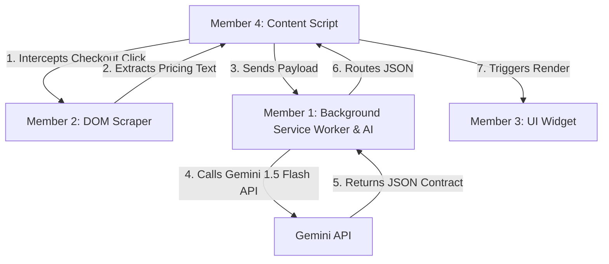

# TrapSight 👁️🔍

> **TrapSight** is a premium, AI-powered Chrome extension designed to expose hidden traps, fine print, and deceptive pricing details in checkout forms. By intercepting the checkout flow, extracting pricing agreements, and analyzing them via the Gemini 1.5 Flash API, TrapSight translates complex legal jargon and subscription traps into simple, clear mathematics before the user completes their purchase.

---

## 🏗️ Project Architecture & Data Flow

TrapSight is divided into four modular components, collaborated on by four development roles:



1. **User Clicks "Checkout"**: Member 4's content script intercepts the action and pauses the checkout process.
2. **Scraping**: Member 2's scraping logic runs, targeting specific pricing elements in the DOM.
3. **AI Processing**: Member 1's background service worker sends the text to the Gemini API and obtains a structured JSON response.
4. **UI Warning**: Member 3's widget displays a modal freezing the page, showing the financial breakdown, and letting the user auto-scroll to the exact point of interest.

---

## 👥 Development Roles & Responsibilities

### 🎯 Member 2: DOM Targeting (The Scraper) — *Your Role*
As the scraper developer, you are responsible for safely and precisely extracting pricing text from the page. Your code lives within the extension's content execution environment and must satisfy:
*   **Scope Restriction**: Limit scraping actions *exclusively* to the 3 target demo websites.
*   **Extraction Accuracy**: Write optimized CSS selectors to extract only the pricing terms and summary containers (e.g., `document.querySelector('.checkout-summary').innerText`), avoiding unnecessary DOM noise.
*   **Routing Logic**: Implement a clean `switch` statement or routing map matching the URL (`window.location.href`) to run the correct scraper.
*   **Deliverable**: A modular, exportable JavaScript function (e.g., `scrapeCheckoutData()`) that can be executed dynamically by Member 4.

> [!TIP]
> Keep selectors robust by targeting IDs or semantic wrapper classes (like `.checkout-summary`, `#cart-total`, `.subscription-details`) to prevent minor UI changes from breaking the scraper.

---

### 🧠 Member 1: Background Script & AI Engine
*   **Setup**: Registers the service worker in `manifest.json`.
*   **API Connection**: Integrates the Gemini 1.5 Flash API directly using the local free-tier key.
*   **Prompting**: Implements a strict system prompt instructing the LLM to output a predictable JSON schema.
*   **Routing**: Receives scraped text from Member 4, calls the Gemini API, and passes back the JSON response.

---

### 🎨 Member 3: UI/UX (The Alert Widget)
*   **Independent Build**: Builds the premium alert widget using a hardcoded JSON contract (simulating the Gemini response).
*   **Widget Design**: Implements a premium, page-freezing alert widget that renders legal jargon as simple mathematical operations.
*   **Action Logic**: Handles the "Read" button, scrolling the user to the highlighted target selector.
*   **Deliverable**: Modular CSS styles and injection-ready HTML/JS components.

---

### 🔌 Member 4: Content Script & Integration
*   **Interception**: Listens to checkout or proceed buttons and calls `event.preventDefault()` to pause navigation.
*   **Data Pipeline**: Runs Member 2's scraper, manages the message port to send data to Member 1, and handles loading states.
*   **Rendering**: Receives the analysis JSON and mounts Member 3's UI widget to display the results.

---

## 🛠️ Installation & Getting Started

1.  **Clone the Repository**:
    ```bash
    git clone https://github.com/seeramsujay/clearer-terms.git
    cd clearer-terms
    ```
2.  **Load the Extension in Chrome**:
    *   Open Chrome and navigate to `chrome://extensions/`.
    *   Enable **Developer mode** (toggle in the top-right corner).
    *   Click **Load unpacked** in the top-left corner.
    *   Select the `clearer-terms` folder.

---

## 📋 JSON Contract Specification
The Gemini API response processed by the background worker conforms to the following structure, which both the Scraper and the UI widget align with:

```json
{
  "hasHiddenFees": true,
  "summaryMath": {
    "basePrice": "$19.99/mo",
    "hiddenCharges": [
      {
        "label": "Activation Fee",
        "amount": "$15.00"
      },
      {
        "label": "Regulatory Recovery Fee",
        "amount": "$2.50/mo"
      }
    ],
    "totalFirstYearCost": "$284.88"
  },
  "warnings": [
    {
      "severity": "high",
      "message": "Auto-renews at full price of $39.99/mo after 3 months.",
      "domSelectorToHighlight": ".auto-renew-terms"
    }
  ]
}
```
