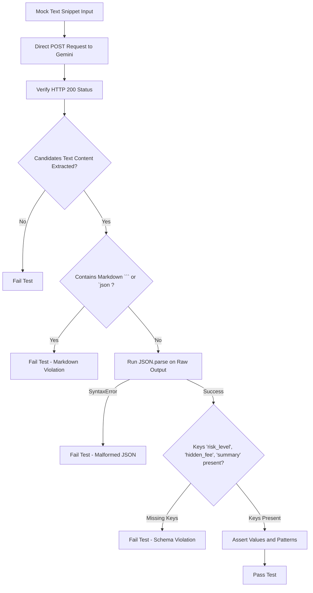

# TrapSight - Direct Gemini API Pipeline Testing Strategy

This testing strategy details how to validate the client-side serverless AI pipeline for **TrapSight** (Manifest V3) using a simulated Node.js environment before mounting it into the browser environment. 

---

## 🎯 Testing Objectives
1. **Direct Connection Security**: Confirm the local Chrome Extension runtime is capable of directly making HTTP POST requests to the `generativelanguage.googleapis.com` endpoint using standard headers without triggering CORS blocks (permitted via `host_permissions` in `manifest.json`).
2. **System Instruction Strictness**: Validate that the `systemInstruction` forces the Gemini 1.5 Flash model to output *only* raw JSON.
3. **Markdown Forbiddance**: Explicitly check that the model complies with the constraint preventing wrapping outputs in markdown backticks (e.g., ` ```json ... ``` `), which breaks vanilla `JSON.parse` logic in client-side extension runtimes.
4. **Strict JSON Schema Contract**: Assert that the output keys (`risk_level`, `hidden_fee`, and `summary`) match the data contract required by Member 3's UI widget exactly.
5. **Dark Pattern Evaluation Accuracy**: Verify that the AI correctly interprets hidden close-out fees and deceptive auto-renewals (e.g., extracting the correct dollar values and categorizing risk levels as `high` or `medium`).

---

## 🔬 Standalone Testing Execution Flow



---

## 🛠️ Step-by-Step Test Guide

### 1. Preparation
Ensure you have Node.js (v18+) installed on your machine. Standard fetch APIs are available globally without needing external npm modules.

### 2. Export your Gemini API Key
Export your key to your shell environment variables:
```bash
export GEMINI_API_KEY="YOUR_ACTUAL_GEMINI_API_KEY_HERE"
```

### 3. Run the Standalone Script
Run the newly created script directly:
```bash
node tests/test_gemini_direct.js
```

---

## 📋 Deployed Assertions

| Assertion | Objective | Target Outcome |
| :--- | :--- | :--- |
| **Assert 1: Basic Structure** | Verify Gemini response payload format | Ensures payload contains candidates list and nested message parts. |
| **Assert 2: Markdown Cleanliness** | Check for forbidden markdown backticks | Guarantees raw string returned is parseable directly. |
| **Assert 3: JSON Parsing** | Run `JSON.parse` on returned text content | Assures response is valid and well-formed. |
| **Assert 4: Strict Contract Schema** | Check presence of `risk_level`, `hidden_fee`, `summary` | Prevents Member 3's UI overlay from encountering undefined keys. |
| **Assert 5: Value Accuracy** | Check output values against mock text | Validates that high-risk elements ($25 fee) are correctly caught. |

---

## ⚠️ Common Edge Cases Checked
* **Model hallucination containing conversational wrappers**: Dealt with by strict instruction inside the `SYSTEM_PROMPT`.
* **Broken JSON structures**: Mitigated by forcing `responseMimeType: "application/json"` inside `generationConfig`.
* **CORS Restrictions**: Standard client-side connections are legally green-lighted via the host rules specified in the `manifest.json` host permissions.
